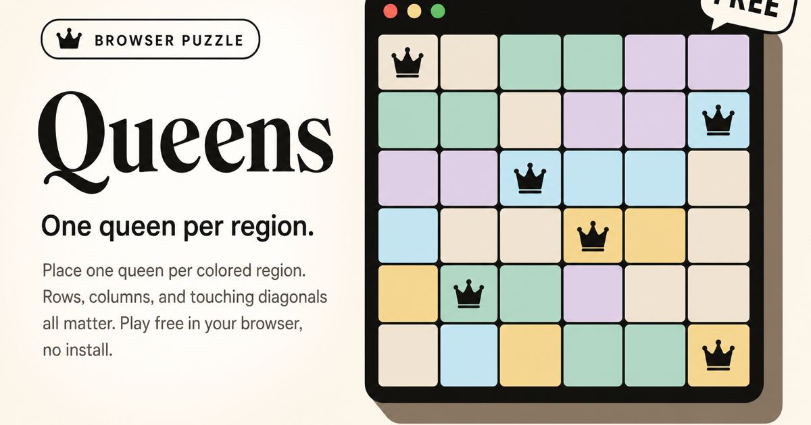

# Queens



A browser implementation of the **LinkedIn-style Queens** puzzle: place one queen per colored region so that no two queens share a row or column, and **no two queens touch diagonally** (corner-adjacent cells are forbidden, not full “bishop” diagonals). Built with **React 19**, **TypeScript**, and **Vite**.

| | |
| --- | --- |
| **Play** | [linkedin-queens-game.vercel.app](https://linkedin-queens-game.vercel.app/) |
| **Source** | [github.com/malik-sohaib-dev/linkedin-queens-game](https://github.com/malik-sohaib-dev/linkedin-queens-game) |

## Run locally

```bash
npm install
npm run dev
```

Other scripts: `npm run build`, `npm run preview`, `npm run lint`.

---

## Author & backlinks

**Malik Sohaib Ahmad** · Full Stack & AI Engineer

- [GitHub (this repository)](https://github.com/malik-sohaib-dev/linkedin-queens-game)
- [LinkedIn](https://www.linkedin.com/in/malik-sohaib/)
- [Portfolio](https://malik-sohaib.vercel.app/)

---

## Case study: how the puzzles and validation work

This section explains the algorithms in `src/utils` and how they connect to the UI.

### Game rules (enforced in the UI)

The live board uses `processGameBoard` to score each move:

1. **At most one queen per region:** each colored area must contain exactly one queen in a valid solution.
2. **At most one queen per row and per column**.
3. **No diagonal touching:** each queen’s **four diagonal neighbors** are checked for another queen (king-style diagonal adjacency only; the code does not scan entire diagonals).

Cells that break any of these rules are marked as conflicting. The puzzle is **solved** when there are no conflicts, every region has exactly one queen, and the total queen count equals the board size (one queen per region for an \(N \times N\) board with \(N\) regions).

---

### 1. Generating a solution board (`solutionBoardGenerator.ts`)

The generator produces a full **design-time** board: queen positions plus a partition of the grid into **regions** that makes those queens the intended solution.

**Step A: Queens and blocked cells (`queensAndBlanksGenerator`)**

- For each row, pick a **random legal column** among cells that are still candidates (`isQueenPossible`).
- After placing a queen, mark the rest of the row and column as impossible, and mark **some** diagonal neighbors below as impossible (implementation-specific pruning; the classic puzzle still allows all diagonal *lines*, but this step shapes the search space for region painting).

The result is **one queen per row and per column** (a random permutation of column indices), with blocked cells guiding later region growth.

**Step B: Painting regions (`regionGenerator`)**

- Each queen seeds a region id (its row index is used as a starting label in the current code).
- From each queen, the algorithm performs a **random walk** on the grid using only **cardinal** steps (up / right / down / left), growing the region by a random budget of cells per queen.
- A placement is **rejected** during the walk if `boxValidation` + `queenBoxingConflict` would create a configuration where queens become “boxed” with no way to extend regions legally (a constraint specific to this generator’s notion of valid region layouts).

**Step C: Fill gaps (`fillUntrackedBoxes`)**

- Cells that never received a region are filled by **absorbing a neighbor’s region** (clockwise scan of adjacent cells until a numbered region is found). This runs until no orphan cells remain.

**Step D: Uniqueness check (conditional)**

- For board sizes **`size <= 8`**, the generator calls `isUniqueSolution`. If the painted regions admit more than one queen placement that satisfies the puzzle rules, generation **throws** and the outer function **retries recursively** until a satisfactory board is produced.
- For **`size > 8`**, the uniqueness check is **skipped** in code (factorial cost becomes impractical), so larger boards are *playable* but not guaranteed unique by this verifier.

**Operational note:** the pipeline uses `console.log` / `console.error` for debugging traces during generation.

---

### 2. Verifying a unique solution (`validateUniqueSolution.ts`)

The verifier answers: *given the region layout, is there exactly **one** assignment of queens (drawn from the permutation search below) that puts **at most one queen per region**?*

**Search space**

- Enumerate **permutations** of the string `"012…(n-1)"`, interpreted as: row `j` places a queen in column `Number(permutation[j])`. That guarantees **exactly one queen per row and per column**.

**Pruning (`test`)**

- Discard permutations where **adjacent rows** would place queens in **column indices that differ by exactly 1** (ruling out immediate diagonal contact between consecutive rows in that assignment).

**Validity**

- For each surviving permutation, count queens per **region id**. If no region has more than one queen, treat it as a valid solution.
- **Unique** iff exactly **one** such assignment exists.

> **Note:** Runtime play uses `processGameBoard`, which checks row/column duplicates and **corner-adjacent** diagonal neighbors between queens. The uniqueness helper does not mirror that entire scan. It searches a combinatorial space of permutations and region counts as above, which is sufficient for the generator’s gate on small boards but is not a bit-identical reimplementation of the UI validator.

**Complexity:** permutations grow as \(N!\). That is why the generator only invokes this for **small \(N\)**.

---

### 3. Live play validation (`gameBoardProcessor.ts`)

While the user plays, `processGameBoard`:

- Resets per-cell `conflict` flags, then scans every queen.
- Flags conflicts for **row**, **column**, **diagonal neighbors**, and **multiple queens in the same region**.
- Returns `hasConflicts` and `queenCount` (sum of per-region counts) for win detection.

The function **mutates** the board for conflict highlighting (it spreads cell updates in place), which keeps rendering simple for the React layer.

---

## Product and UX features

| Area | Implementation |
| --- | --- |
| **Board sizes** | Grids from **5×5** through **10×10**, with async generation off the main thread via `requestAnimationFrame` + `setTimeout`. |
| **New puzzle / restart** | Regenerates or clears the player board while disabling controls during generation. |
| **Solution panel** | Optional **reference solution** view, with `inert` / `aria-hidden` when hidden so assistive tech focuses the main puzzle. |
| **Tutorial & celebration** | Modal **how to play**, **win** dialog with follow-up action to generate another puzzle, Escape to dismiss, focus management on open. |
| **Feedback** | **Confetti** burst on solve; **inline conflict** styling; **board overlay loader** during generation so layout does not jump. |
| **Input** | Click to cycle queen / blank / empty; **mouse drag** paints crosses (blanks) when the mouse button is held. |
| **Accessibility** | `aria-busy` on main while generating, `aria-live` regions for status, visible focus styles, semantic dialogs, `aria-label` on icon-only controls. |

---

## Project layout

```
src/
  App.tsx                 # Game shell, modals, board UI
  components/             # Confetti, Castle (queen glyph)
  utils/
    common.ts             # Shared types & boundary helper
    solutionBoardGenerator.ts
    validateUniqueSolution.ts
    gameBoardProcessor.ts
```

---
